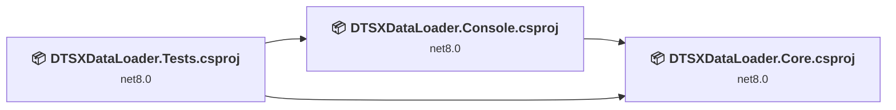
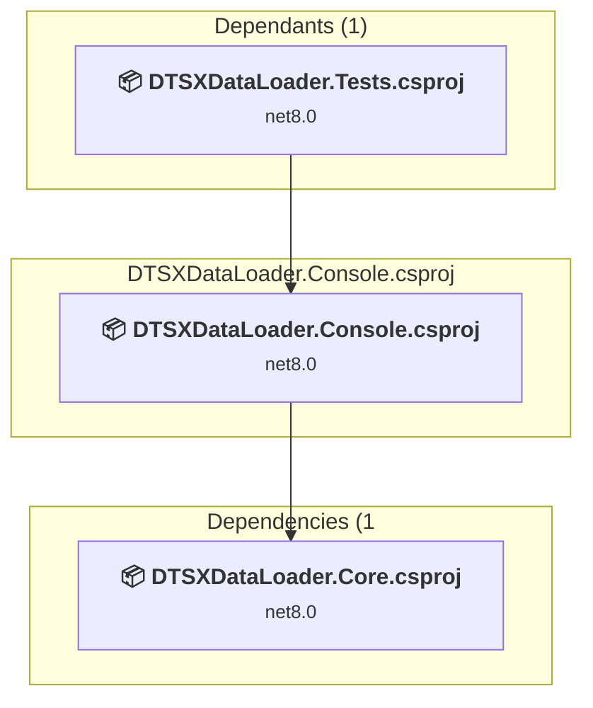
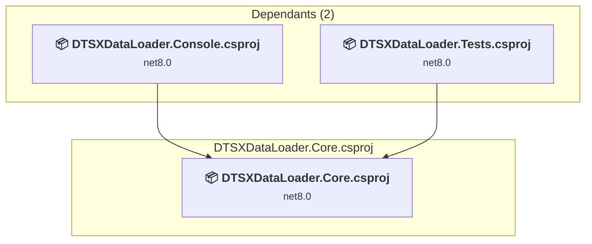
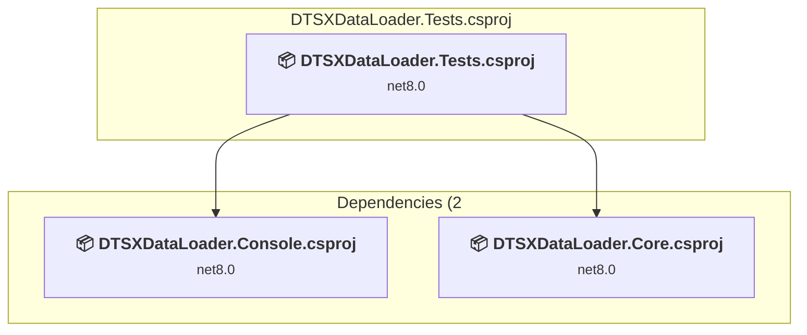

# Projects and dependencies analysis

This document provides a comprehensive overview of the projects and their dependencies in the context of upgrading to .NETCoreApp,Version=v10.0.

## Table of Contents

- [Executive Summary](#executive-Summary)
  - [Highlevel Metrics](#highlevel-metrics)
  - [Projects Compatibility](#projects-compatibility)
  - [Package Compatibility](#package-compatibility)
  - [API Compatibility](#api-compatibility)
  - [Binding Redirect Configuration](#binding-redirect-configuration)
- [Aggregate NuGet packages details](#aggregate-nuget-packages-details)
- [Top API Migration Challenges](#top-api-migration-challenges)
  - [Technologies and Features](#technologies-and-features)
  - [Most Frequent API Issues](#most-frequent-api-issues)
- [Projects Relationship Graph](#projects-relationship-graph)
- [Project Details](#project-details)

  - [DTSXDataLoader.Console\DTSXDataLoader.Console.csproj](#dtsxdataloaderconsoledtsxdataloaderconsolecsproj)
  - [DTSXDataLoader.Core\DTSXDataLoader.Core.csproj](#dtsxdataloadercoredtsxdataloadercorecsproj)
  - [DTSXDataLoader.Tests\DTSXDataLoader.Tests.csproj](#dtsxdataloadertestsdtsxdataloadertestscsproj)

## Executive Summary

### Highlevel Metrics

| Metric | Count | Status |
| :--- | :---: | :--- |
| Total Projects | 3 | All require upgrade |
| Total NuGet Packages | 15 | 9 need upgrade |
| Total Code Files | 37 |  |
| Total Code Files with Incidents | 5 |  |
| Total Lines of Code | 2620 |  |
| Total Number of Issues | 32 |  |
| Estimated LOC to modify | 12+ | at least 0.5% of codebase |

### Projects Compatibility

| Project | Target Framework | Difficulty | Package Issues | API Issues | Binding Issues | Est. LOC Impact | Description |
| :--- | :---: | :---: | :---: | :---: | :---: | :---: | :--- |
| [DTSXDataLoader.Console\DTSXDataLoader.Console.csproj](#dtsxdataloaderconsoledtsxdataloaderconsolecsproj) | net8.0 | 🟢 Low | 8 | 2 | 0 | 2+ | DotNetCoreApp, Sdk Style = True |
| [DTSXDataLoader.Core\DTSXDataLoader.Core.csproj](#dtsxdataloadercoredtsxdataloadercorecsproj) | net8.0 | 🟢 Low | 8 | 10 | 0 | 10+ | ClassLibrary, Sdk Style = True |
| [DTSXDataLoader.Tests\DTSXDataLoader.Tests.csproj](#dtsxdataloadertestsdtsxdataloadertestscsproj) | net8.0 | 🟢 Low | 1 | 0 | 0 |  | DotNetCoreApp, Sdk Style = True |

### Package Compatibility

| Status | Count | Percentage |
| :--- | :---: | :---: |
| ✅ Compatible | 6 | 40.0% |
| ⚠️ Incompatible | 1 | 6.7% |
| 🔄 Upgrade Recommended | 8 | 53.3% |
| ***Total NuGet Packages*** | ***15*** | ***100%*** |

### API Compatibility

| Category | Count | Impact |
| :--- | :---: | :--- |
| 🔴 Binary Incompatible | 11 | High - Require code changes |
| 🟡 Source Incompatible | 0 | Medium - Needs re-compilation and potential conflicting API error fixing |
| 🔵 Behavioral change | 1 | Low - Behavioral changes that may require testing at runtime |
| ✅ Compatible | 2691 |  |
| ***Total APIs Analyzed*** | ***2703*** |  |

## Aggregate NuGet packages details

| Package | Current Version | Suggested Version | Projects | Description |
| :--- | :---: | :---: | :--- | :--- |
| CommandLineParser | 2.9.1 |  | [DTSXDataLoader.Console.csproj](#dtsxdataloaderconsoledtsxdataloaderconsolecsproj) | ✅Compatible |
| coverlet.collector | 6.0.0 |  | [DTSXDataLoader.Tests.csproj](#dtsxdataloadertestsdtsxdataloadertestscsproj) | ✅Compatible |
| Dapper | 2.1.35 |  | [DTSXDataLoader.Core.csproj](#dtsxdataloadercoredtsxdataloadercorecsproj) | ✅Compatible |
| Microsoft.Data.SqlClient | 5.2.1 |  | [DTSXDataLoader.Core.csproj](#dtsxdataloadercoredtsxdataloadercorecsproj) | ✅Compatible |
| Microsoft.Extensions.Configuration | 8.0.0 | 10.0.10 | [DTSXDataLoader.Console.csproj](#dtsxdataloaderconsoledtsxdataloaderconsolecsproj) [DTSXDataLoader.Core.csproj](#dtsxdataloadercoredtsxdataloadercorecsproj) | NuGet package upgrade is recommended |
| Microsoft.Extensions.Configuration.Binder | 8.0.2 | 10.0.10 | [DTSXDataLoader.Console.csproj](#dtsxdataloaderconsoledtsxdataloaderconsolecsproj) [DTSXDataLoader.Core.csproj](#dtsxdataloadercoredtsxdataloadercorecsproj) | NuGet package upgrade is recommended |
| Microsoft.Extensions.Configuration.CommandLine | 8.0.0 | 10.0.10 | [DTSXDataLoader.Console.csproj](#dtsxdataloaderconsoledtsxdataloaderconsolecsproj) [DTSXDataLoader.Core.csproj](#dtsxdataloadercoredtsxdataloadercorecsproj) | NuGet package upgrade is recommended |
| Microsoft.Extensions.Configuration.EnvironmentVariables | 8.0.0 | 10.0.10 | [DTSXDataLoader.Console.csproj](#dtsxdataloaderconsoledtsxdataloaderconsolecsproj) [DTSXDataLoader.Core.csproj](#dtsxdataloadercoredtsxdataloadercorecsproj) | NuGet package upgrade is recommended |
| Microsoft.Extensions.Configuration.Json | 8.0.0 | 10.0.10 | [DTSXDataLoader.Console.csproj](#dtsxdataloaderconsoledtsxdataloaderconsolecsproj) [DTSXDataLoader.Core.csproj](#dtsxdataloadercoredtsxdataloadercorecsproj) | NuGet package upgrade is recommended |
| Microsoft.Extensions.DependencyInjection | 8.0.0 | 10.0.10 | [DTSXDataLoader.Console.csproj](#dtsxdataloaderconsoledtsxdataloaderconsolecsproj) [DTSXDataLoader.Core.csproj](#dtsxdataloadercoredtsxdataloadercorecsproj) | NuGet package upgrade is recommended |
| Microsoft.Extensions.Logging.Console | 8.0.0 | 10.0.10 | [DTSXDataLoader.Console.csproj](#dtsxdataloaderconsoledtsxdataloaderconsolecsproj) [DTSXDataLoader.Core.csproj](#dtsxdataloadercoredtsxdataloadercorecsproj) | NuGet package upgrade is recommended |
| Microsoft.NET.Test.Sdk | 17.8.0 |  | [DTSXDataLoader.Tests.csproj](#dtsxdataloadertestsdtsxdataloadertestscsproj) | ✅Compatible |
| Newtonsoft.Json | 13.0.3 | 13.0.4 | [DTSXDataLoader.Console.csproj](#dtsxdataloaderconsoledtsxdataloaderconsolecsproj) [DTSXDataLoader.Core.csproj](#dtsxdataloadercoredtsxdataloadercorecsproj) | NuGet package upgrade is recommended |
| xunit | 2.5.3 |  | [DTSXDataLoader.Tests.csproj](#dtsxdataloadertestsdtsxdataloadertestscsproj) | ⚠️NuGet package is deprecated |
| xunit.runner.visualstudio | 2.5.3 |  | [DTSXDataLoader.Tests.csproj](#dtsxdataloadertestsdtsxdataloadertestscsproj) | ✅Compatible |

## Top API Migration Challenges

### Technologies and Features

| Technology | Issues | Percentage | Migration Path |
| :--- | :---: | :---: | :--- |

### Most Frequent API Issues

| API | Count | Percentage | Category |
| :--- | :---: | :---: | :--- |
| M:Microsoft.Extensions.Configuration.ConfigurationBinder.GetValue''1(Microsoft.Extensions.Configuration.IConfiguration,System.String) | 10 | 83.3% | Binary Incompatible |
| M:Microsoft.Extensions.Configuration.ConfigurationBinder.Get''1(Microsoft.Extensions.Configuration.IConfiguration) | 1 | 8.3% | Binary Incompatible |
| M:Microsoft.Extensions.Logging.ConsoleLoggerExtensions.AddConsole(Microsoft.Extensions.Logging.ILoggingBuilder) | 1 | 8.3% | Behavioral Change |

## Projects Relationship Graph

Legend:
📦 SDK-style project
⚙️ Classic project

## Project Details

### DTSXDataLoader.Console\DTSXDataLoader.Console.csproj

#### Project Info

- **Current Target Framework:** net8.0
- **Proposed Target Framework:** net10.0
- **SDK-style**: True
- **Project Kind:** DotNetCoreApp
- **Dependencies**: 1
- **Dependants**: 1
- **Number of Files**: 6
- **Number of Files with Incidents**: 2
- **Lines of Code**: 597
- **Estimated LOC to modify**: 2+ (at least 0.3% of the project)

#### Dependency Graph

Legend:
📦 SDK-style project
⚙️ Classic project

### API Compatibility

| Category | Count | Impact |
| :--- | :---: | :--- |
| 🔴 Binary Incompatible | 1 | High - Require code changes |
| 🟡 Source Incompatible | 0 | Medium - Needs re-compilation and potential conflicting API error fixing |
| 🔵 Behavioral change | 1 | Low - Behavioral changes that may require testing at runtime |
| ✅ Compatible | 529 |  |
| ***Total APIs Analyzed*** | ***531*** |  |

### DTSXDataLoader.Core\DTSXDataLoader.Core.csproj

#### Project Info

- **Current Target Framework:** net8.0
- **Proposed Target Framework:** net10.0
- **SDK-style**: True
- **Project Kind:** ClassLibrary
- **Dependencies**: 0
- **Dependants**: 2
- **Number of Files**: 20
- **Number of Files with Incidents**: 2
- **Lines of Code**: 1763
- **Estimated LOC to modify**: 10+ (at least 0.6% of the project)

#### Dependency Graph

Legend:
📦 SDK-style project
⚙️ Classic project

### API Compatibility

| Category | Count | Impact |
| :--- | :---: | :--- |
| 🔴 Binary Incompatible | 10 | High - Require code changes |
| 🟡 Source Incompatible | 0 | Medium - Needs re-compilation and potential conflicting API error fixing |
| 🔵 Behavioral change | 0 | Low - Behavioral changes that may require testing at runtime |
| ✅ Compatible | 1942 |  |
| ***Total APIs Analyzed*** | ***1952*** |  |

### DTSXDataLoader.Tests\DTSXDataLoader.Tests.csproj

#### Project Info

- **Current Target Framework:** net8.0
- **Proposed Target Framework:** net10.0
- **SDK-style**: True
- **Project Kind:** DotNetCoreApp
- **Dependencies**: 2
- **Dependants**: 0
- **Number of Files**: 13
- **Number of Files with Incidents**: 1
- **Lines of Code**: 260
- **Estimated LOC to modify**: 0+ (at least 0.0% of the project)

#### Dependency Graph

Legend:
📦 SDK-style project
⚙️ Classic project

### API Compatibility

| Category | Count | Impact |
| :--- | :---: | :--- |
| 🔴 Binary Incompatible | 0 | High - Require code changes |
| 🟡 Source Incompatible | 0 | Medium - Needs re-compilation and potential conflicting API error fixing |
| 🔵 Behavioral change | 0 | Low - Behavioral changes that may require testing at runtime |
| ✅ Compatible | 220 |  |
| ***Total APIs Analyzed*** | ***220*** |  |

