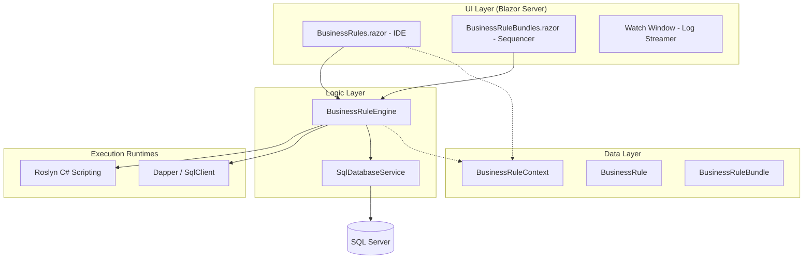
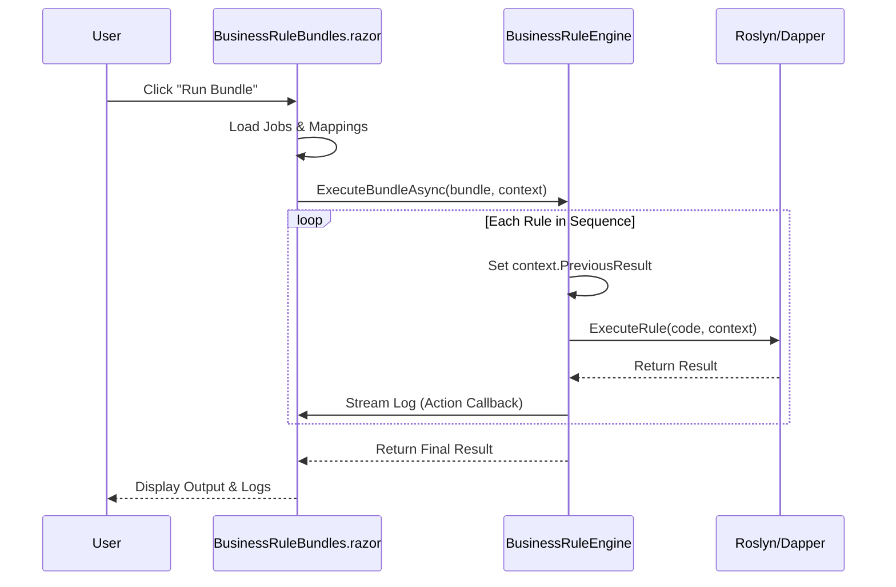

# Architecture Overview - Business Rules & ETL Analytics

This document provides a high-level technical overview of the architectural components, data flow, and design patterns used in the Business Rules system.

## Technology Stack

- **Frontend**: Blazor Server with [Radzen Blazor Components](https://blazor.radzen.com/).
- **Data Access**: [Dapper](https://github.com/DapperLib/Dapper) for high-performance SQL mapping.
- **Scripting Engine**: [Microsoft.CodeAnalysis.CSharp.Scripting](https://www.nuget.org/packages/Microsoft.CodeAnalysis.CSharp.Scripting/) (Roslyn) for dynamic C# execution.
- **Database**: SQL Server.

## System Components

## Data Lifecycle & Piping

The system is designed for **stateful sequencing**. Each execution step can influence the next.

1. **Context Hydration**: Right before execution, the UI requests `Jobs` and `Mappings` from `SqlDatabaseService`.
2. **Global Injector**: `BusinessRuleEngine` creates a `BusinessRuleContext` which acts as the `Globals` object for Roslyn.
3. **Piping (Bundles)**: 
    - `Step N` executes and returns a result.
    - The engine assigns this result to `context.PreviousResult`.
    - `Step N+1` begins, with access to `PreviousResult`.

## Versioning Pattern

The system uses a **Shadow History Table** pattern for version control:

- **BusinessRules**: Holds the "Current" version of a rule.
- **BusinessRuleHistory**: An append-only table. 
- **The Flow**: When a rule is updated, the `SqlDatabaseService` performs a transactional move:
    1. Copy current row to `BusinessRuleHistory`.
    2. Update `BusinessRules` row and increment `Version`.

## Key Architectural Files

| File | Role | Responsibility |
| :--- | :--- | :--- |
| `BusinessRuleEngine.cs` | **Executor** | Compiles C#, executes SQL, handles logging callbacks. |
| `SqlDatabaseService.cs` | **Persistence** | Table initialization, transactional CRUD, versioning. |
| `BusinessRuleContext.cs` | **Bridge** | The data contract between the App and the Scripts. |
| `BusinessRules.razor` | **IDE** | Sidebar navigation, Monaco-style editor, real-time watch. |
| `BusinessRuleBundles.razor` | **Orchestrator** | Sequential ordering and multi-step execution logic. |

## Security & Isolation

> [!NOTE]
> **Script Isolation**: C# scripts are executed within the same process as the Blazor Server app. While Roslyn provides compilation safety, logic within scripts has access to the `BusinessRuleContext` and should be treated as trusted code.

## Execution Flow (Sequence)

