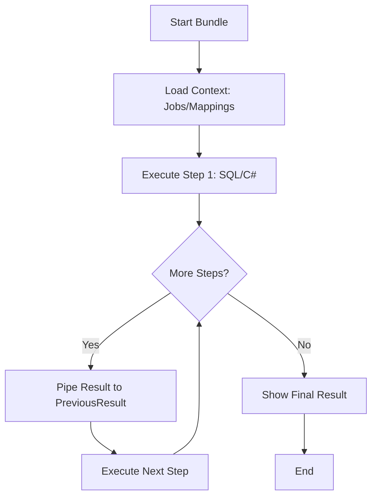
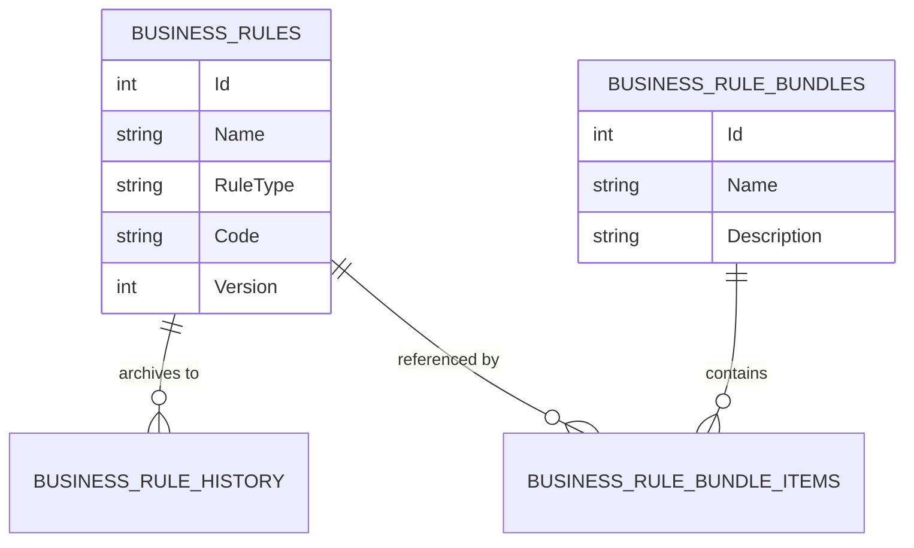

# Business Rules Engine Documentation

The Business Rules engine is a powerful, versionable system for executing custom logic against AutoSys JIL data. It supports both T-SQL for high-performance data querying and C# (Roslyn) for complex procedural logic.

## Core Concepts

### 1. Rule Types
- **T-SQL**: Executed via Dapper. Best for filtering, auditing, and bulk data analysis.
- **C# Script**: Executed via Roslyn Scripting API. Best for complex validation, string manipulation, and cross-referencing logic.

### 2. Rule Bundles & Sequencing
Bundles allow you to group multiple rules into a logical sequence. The engine executes them in the defined `SequenceOrder`.

### 3. Data Piping (Naming Conventions)
The engine provides two ways to access data from earlier rules in a sequence:

| Convention | Language | Description |
| :--- | :--- | :--- |
| `PreviousResult` | C# | The output of the **immediately preceding** rule. |
| `@PreviousResultJson`| T-SQL | The output of the **immediately preceding** rule (JSON). |
| `StepResults[n]` | C# | A dictionary of **all results** from earlier steps, where `n` is the `SequenceOrder`. |
| `@StepResultsJson` | T-SQL | A JSON object containing **all results** from earlier steps (e.g., `{"1": [...], "2": {...}}`). |

> [!TIP]
> **Standalone Execution**: When running a rule individually in the IDE, `@PreviousResultJson` and `@StepResultsJson` are automatically declared as empty (`[]` and `{}` respectively) to prevent execution errors, allowing you to test bundle-aware scripts easily.

---

## Execution Context (C# Scripts)

C# scripts have direct access to the following global variables:

| Variable | Type | Description |
| :--- | :--- | :--- |
| `Jobs` | `List<JilJob>` | The full list of AutoSys jobs from the latest import. |
| `JobToPackageMappings` | `List<AutoSysJobToPackage>` | Current job-to-package mapping data. |
| `PreviousResult` | `object?` | The return value from the previous step in a bundle. |
| `StepResults` | `Dictionary<int, object?>` | All results from earlier steps, keyed by SequenceOrder. |
| `Log(string)` | `Action<string>` | A helper to write to the execution watch window. |

---

## Examples

### T-SQL: Data Piping (Bundles)
When a T-SQL rule follows another rule in a bundle, the previous result is available via the `@PreviousResultJson` parameter. You can use SQL Server's `OPENJSON` to parse it.

#### Example: Processing Step 1 Results
If Step 1 (SQL or C#) returns a list of items with `JobName` and `Status`:

```sql
-- Step 2: Use the results from Step 1
SELECT 
    JSON_VALUE(value, '$.JobName') as JobName,
    JSON_VALUE(value, '$.Status') as Status
FROM OPENJSON(@PreviousResultJson)
WHERE JSON_VALUE(value, '$.Status') = 'Warning'
```

#### Example: Inserting Results into an Audit Table
```sql
-- Create a temp table or use a permanent log table
-- Note: Ensure the table exists or create it in the script
IF OBJECT_ID('tempdb..#BatchResults') IS NULL 
    CREATE TABLE #BatchResults (JobName NVARCHAR(255), DetectedAt DATETIME);

INSERT INTO #BatchResults (JobName, DetectedAt)
SELECT 
    JSON_VALUE(value, '$.JobName'),
    GETDATE()
FROM OPENJSON(@PreviousResultJson)
WHERE JSON_VALUE(value, '$.JobName') IS NOT NULL;

-- Return the inserted rows to confirm
SELECT * FROM #BatchResults;
```

### C# Script: Sequencing Example
A script that processes the output of the T-SQL audit above.
```csharp
// PreviousResult is the List<dynamic> from the SQL step
var unmappedJobs = PreviousResult as IEnumerable<dynamic>;

if (unmappedJobs == null) {
    return "No data to process from previous step.";
}

Log($"Processing {unmappedJobs.Count()} unmapped jobs...");

var criticalViolations = unmappedJobs
    .Where(j => j.Application == "CORE_FINANCE")
    .Select(j => j.JobName)
    .ToList();

return new {
    CriticalCount = criticalViolations.Count,
    Jobs = criticalViolations,
    Priority = criticalViolations.Any() ? "High" : "Low"
};
```

### Accessing Historical Steps (Beyond the Immediate Previous)

If you are in Step 3 and need data from Step 1, use the historical accessors:

#### C# Example: Accessing Step 1 from Step 3
```csharp
// Get result from the first step in the bundle
var step1Data = StepResults[1] as IEnumerable<dynamic>;

if (step1Data != null) {
    Log($"Rule 3 is referencing data from Rule 1 ({step1Data.Count()} rows)");
}
```

#### T-SQL Example: Accessing Step 1 from Step 3
```sql
-- Use @StepResultsJson and specify the key '1'
SELECT 
    JSON_VALUE(value, '$.JobName') as Step1Job
FROM OPENJSON(@StepResultsJson, '$."1"')
```

---

## Execution Flow



## Database Schema


