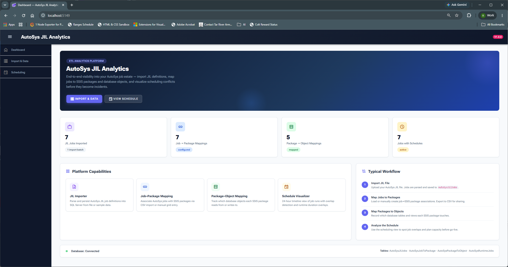
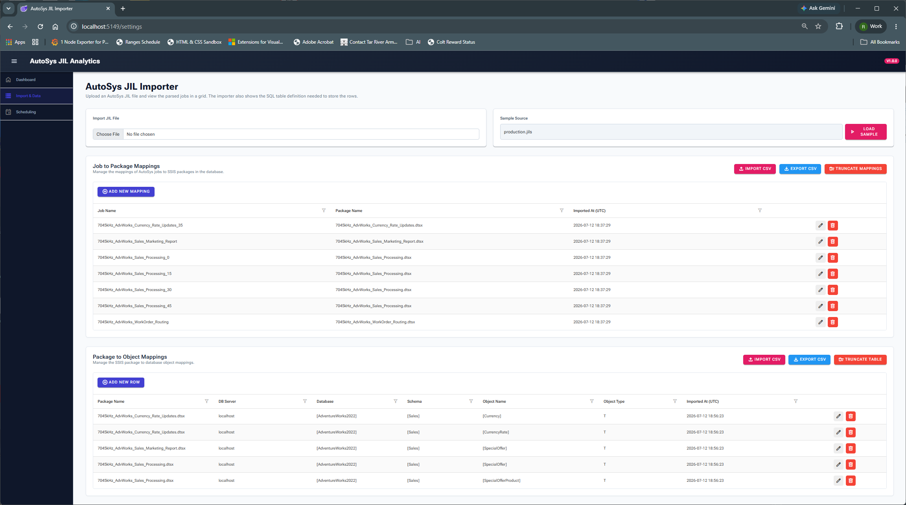
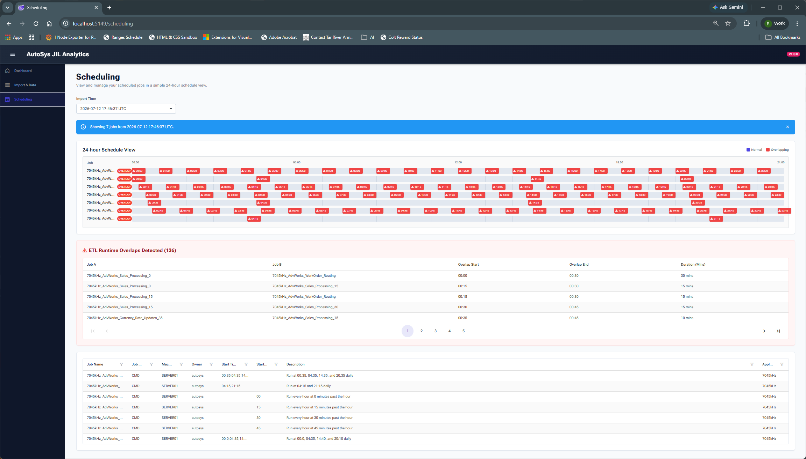

# ETL Analytics

A web application for analyzing AutoSys JIL job definitions and visualizing scheduling and data access conflicts.
## Status
Work in progress...

## Images








## How to Run

```bash
dotnet build
dotnet run
```

## How to Deploy

```bash
# Build release version
dotnet publish -c Release -r win-x64 --self-contained true

# Deploy to a different machine
# Copy the output folder to the target machine and run the executable
```
